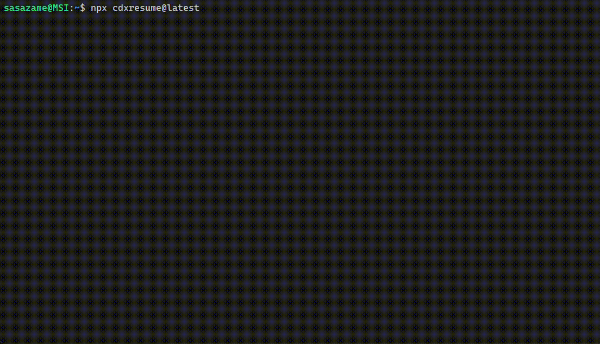

# cdxresume

A character user interface (CUI) tool for browsing and resuming OpenAI Codex CLI sessions.


**⚠️ DISCLAIMER: This is an unofficial third-party tool not affiliated with or endorsed by OpenAI. Use at your own risk.**

## Overview

cdxresume provides an interactive terminal interface to browse and manage your Codex CLI session history. It reads session data from your local Codex CLI logs and displays them in an easy-to-navigate format.

## Disclaimer / Important Notes

- This is an unofficial tool for extending Codex CLI. It is not affiliated with or endorsed by the Codex CLI authors.
- Official Codex CLI (rust-v0.30.0) now supports `--resume` (interactive picker) and `--continue` (latest session). cdxresume remains compatible and valuable as a session browser and launcher.
- cdxresume resumes a specific selection by passing Codex’s experimental override: `codex -c experimental_resume=<path-to-jsonl>`.
  - This path-based resume remains supported upstream and is the correct way to resume an exact rollout file from a third-party launcher.
  - You can also pass `--resume` or `--continue` directly to Codex if you prefer its native picker/latest behavior; note that doing so ignores the selection made in cdxresume and lets Codex decide.
- This project was created by adapting and reworking the UI/logic from `ccresume` (a Claude Code tool): https://github.com/sasazame/ccresume. It is not a GitHub fork; it is a new repository derived from the original concept and components.

### Key Features

- 📋 Browse OpenAI Codex CLI sessions across projects
- 🔍 View detailed conversation information
- 📎 Copy session IDs to clipboard
- 🚀 Start new Codex sessions in selected project directories
- 📁 Filter conversations to current directory with `.` argument
- 🎭 Hide specific message types for cleaner display
- ⚙️ Edit Codex command options interactively before starting sessions
- 🔄 Toggle full conversation view to see complete message history



## Installation

### Via npx (Recommended)

```bash
npx cdxresume@latest
```

### Global Installation

```bash
npm install -g cdxresume
```

## Usage

Run the command in your terminal:

```bash
cdxresume
```

Or if using npx:

```bash
npx cdxresume@latest
```

### Command Line Options

#### cdxresume Options

```bash
# Hide specific message types
cdxresume --hide              # Default: hides tool and thinking messages
cdxresume --hide tool         # Hide only tool messages
cdxresume --hide user         # Hide only user messages
cdxresume --hide assistant    # Hide only assistant messages
cdxresume --hide tool user  # Hide multiple types

# Filter to current directory
cdxresume .

# Show help
cdxresume --help
cdxresume -h

# Show version
cdxresume --version
cdxresume -v
```

#### Passing Options to Codex

All unrecognized command-line arguments are passed directly to the `codex` command when resuming a conversation.

```bash
# Pass options to codex
cdxresume --some-codex-flag

# Combine cdxresume and codex options
cdxresume --hide tool --model opus 
cdxresume . --hide --some-codex-flag
```

Notes:
- All unrecognized arguments are forwarded to Codex. If you pass `--resume` or `--continue`, Codex’s native picker/auto-resume takes over (cdxresume’s selection will be ignored).

## Requirements

- **Node.js** >= 18
- **OpenAI Codex CLI** - Must be installed and configured
- **Operating System** - Works on macOS, Linux, and Windows (both native & WSL)

## Command Editor

Press `-` to open the command editor, where you can configure Codex CLI options before starting or resuming a session. The editor provides:

- **Autocomplete suggestions** - Type `-` to see matching Codex options
- **Official help text** - View all available Codex CLI options
- **Interactive editing** - Use arrow keys, Tab for autocomplete, Enter to confirm

The configured options will be passed to Codex when you start a new session (`n`) or resume a conversation (`Enter`).

**Note**: The options list is based on Codex's help text at a specific point in time. Please refer to `codex --help` for the latest available options.

## Keyboard Controls

### Default Key Bindings

| Action | Keys |
|--------|------|
| Quit | `q` |
| Select Previous | `↑` |
| Select Next | `↓` |
| Confirm/Resume | `Enter` |
| Start New Session | `n` |
| Edit Command Options | `-` |
| Copy Session ID | `c` |
| Scroll Up | `k` |
| Scroll Down | `j` |
| Page Up | `u`, `PageUp` |
| Page Down | `d`, `PageDown` |
| Scroll to Top | `g` |
| Scroll to Bottom | `G` |
| Next Page | `→`|
| Previous Page | `←` |
| Toggle Full View | `f` |

### Custom Key Bindings

You can customize key bindings by creating a configuration file at `~/.config/cdxresume/config.toml`:

```toml
[keybindings]
quit = ["q", "ctrl+c", "esc"]
selectPrevious = ["up", "k"]
selectNext = ["down", "j"]
confirm = ["enter", "l"]
copySessionId = ["y"]
scrollUp = ["u", "ctrl+u"]
scrollDown = ["d", "ctrl+d"]
scrollPageUp = ["b", "ctrl+b"]
scrollPageDown = ["f", "ctrl+f"]
scrollTop = ["g"]
scrollBottom = ["shift+g"]
pageNext = ["right", "n"]
pagePrevious = ["left", "p"]
startNewSession = ["n"]
openCommandEditor = ["-"]
toggleFullView = ["f"]
```

See `config.toml.example` in the repository for a complete example.

## Development

### Setup

```bash
# Clone the repository
git clone https://github.com/yourusername/cdxresume.git
cd cdxresume

# Install dependencies
npm install
```

### Available Scripts

```bash
# Run in development mode
npm run dev

# Build the project
npm run build

# Run tests
npm test

# Run tests in watch mode
npm run test:watch

# Generate test coverage
npm run test:coverage

# Run linter
npm run lint

# Type check
npm run typecheck
```

### Project Structure

```
cdxresume/
├── src/              # Source code
│   ├── cli.tsx       # CLI entry point
│   ├── App.tsx       # Main application component
│   └── ...           # Other components and utilities
├── dist/             # Compiled output
├── tests/            # Test files
└── package.json      # Project configuration
```

## Contributing

Contributions are welcome! Please feel free to submit a Pull Request.

1. Fork the repository
2. Create your feature branch (`git checkout -b feature/AmazingFeature`)
3. Commit your changes (`git commit -m 'Add some AmazingFeature'`)
4. Push to the branch (`git push origin feature/AmazingFeature`)
5. Open a Pull Request

## License

MIT

## Support

For issues and feature requests, please use the [GitHub issue tracker](https://github.com/sasazame/cdxresume/issues).

## Known Issues

- Resume history rendering has improved in newer Codex CLI versions (rust-v0.30.0+). If you previously saw limited chat history after resume, updating Codex may resolve it.
- Exact transcript visibility is ultimately controlled by Codex. When using `-c experimental_resume=<path>`, behavior may differ from Codex’s built-in `--resume` picker. If you prefer Codex-managed resume, pass `--resume` to use the native picker.

Remember: This is an unofficial tool. For official OpenAI Codex CLI support, please refer to OpenAI's documentation.
