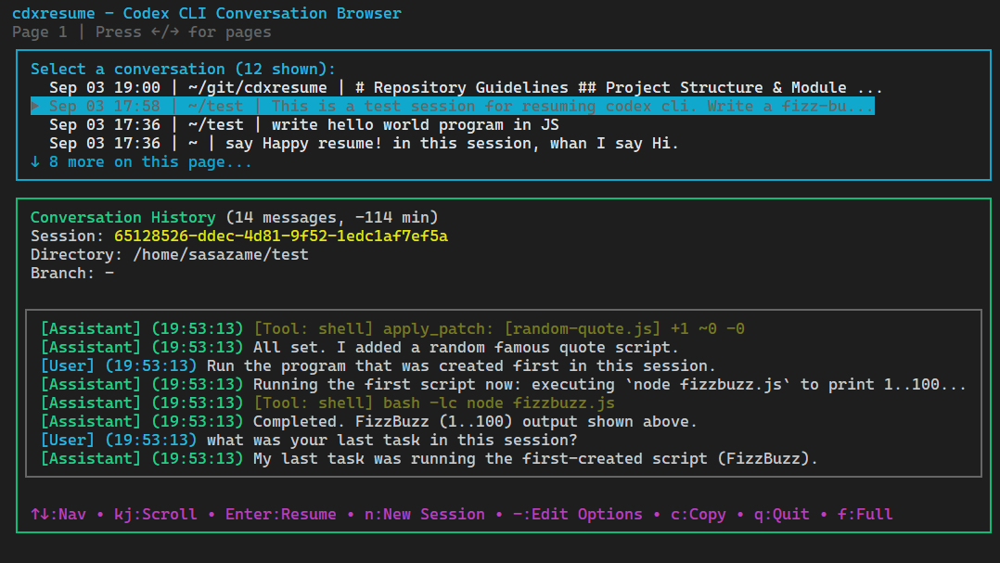
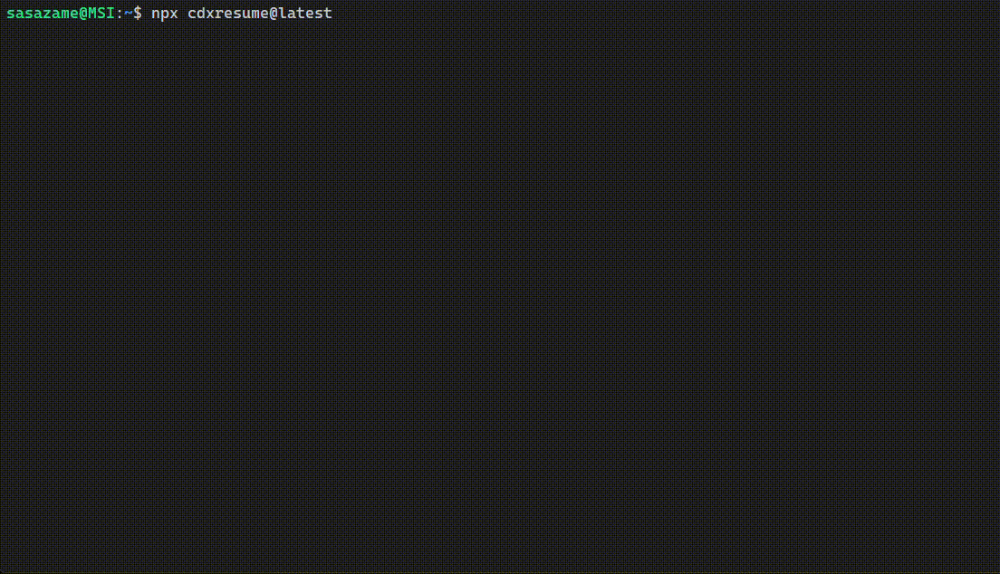

# cdxresume

A character user interface (CUI) tool for browsing and resuming OpenAI Codex CLI sessions.



**⚠️ DISCLAIMER: This is an unofficial third-party tool not affiliated with or endorsed by OpenAI. Use at your own risk.**

## Overview

cdxresume provides an interactive terminal interface to browse and manage your Codex CLI session history. It reads session data from your local Codex CLI logs and displays them in an easy-to-navigate format.

Important compatibility note (Codex 0.32.0+):
- Codex 0.32.0 introduced a breaking change to the rollout JSONL format saved under `~/.codex/sessions/YYYY/MM/DD/*.jsonl`.
- Logs created by Codex 0.31.x and earlier (legacy format) are not compatible with the new format (and vice versa).
- cdxresume detects your installed Codex version and reads only the matching format:
  - 0.32.0 or newer: reads only the new format
  - 0.31.x or older: reads only the legacy format
- Cross‑format conversion is not implemented at this time.

## Disclaimer / Important Notes

- This is an unofficial tool for extending Codex CLI. It is not affiliated with or endorsed by the Codex CLI authors.
- Official Codex CLI (v0.30.0) now supports `--resume` (interactive picker) and `--continue` (latest session). cdxresume remains compatible and valuable as a session browser and launcher. See the release notes: [rust-v0.30.0](https://github.com/openai/codex/releases/tag/rust-v0.30.0).
- cdxresume prefers native Codex resume flags when available. If your Codex build supports them, cdxresume will launch with `--resume <sessionId>` (or `--session-id <uuid>`). For older Codex builds, it falls back to `-c experimental_resume=<path-to-jsonl>`.
- If the installed Codex build doesn’t support resuming by session or file path, cdxresume starts a new session and shows a notice.
- This project was created by adapting and reworking the UI/logic from `ccresume` (a Claude Code tool): https://github.com/sasazame/ccresume. It is not a GitHub fork; it is a new repository derived from the original concept and components.

### Key Features

- 📋 Browse OpenAI Codex CLI sessions across projects
- 🔍 View detailed conversation information
- 📎 Copy session IDs to clipboard
- 🚀 Start new Codex sessions in selected project directories
- 📁 Filter conversations to current directory with `.` argument
- 🎭 Hide specific message types for cleaner display
- ⚙️ Edit Codex command options interactively before starting sessions
- 🔄 Toggle full conversation view to see complete message history



## Installation

### Via npx (Recommended)

```bash
npx cdxresume@latest
```

### Global Installation

```bash
npm install -g cdxresume
```

## Usage

Run the command in your terminal:

```bash
cdxresume
```

Or if using npx:

```bash
npx cdxresume@latest
```

### Command Line Options

#### cdxresume Options

```bash
# Hide specific message types
cdxresume --hide              # Default: hides tool and thinking messages
cdxresume --hide tool         # Hide only tool messages
cdxresume --hide user         # Hide only user messages
cdxresume --hide assistant    # Hide only assistant messages
cdxresume --hide tool user  # Hide multiple types

# Filter to current directory
cdxresume .

# Show help
cdxresume --help
cdxresume -h

# Show version
cdxresume --version
cdxresume -v
```

#### Passing Options to Codex

All unrecognized command-line arguments are passed directly to the `codex` command when resuming a conversation.

```bash
# Pass options to codex
cdxresume --some-codex-flag

# Combine cdxresume and codex options
cdxresume --hide tool --model opus 
cdxresume . --hide --some-codex-flag
```

Notes:
- All unrecognized arguments are forwarded to Codex. If you pass `--resume` or `--continue`, Codex’s native picker/auto-resume takes over (cdxresume’s selection will be ignored).
- To ensure cdxresume’s chosen session is resumed, avoid passing `--resume`/`--continue` yourself. cdxresume will prefer native `--resume`/`--session-id` automatically when supported, and only fall back to `-c experimental_resume=<path>` on older Codex builds.

## Requirements

- **Node.js** 20 / 22 / 24 (LTS)
- **OpenAI Codex CLI** - Must be installed and configured
- **Operating System** - Works on macOS, Linux, and Windows (both native & WSL)

## Command Editor

Press `-` to open the command editor, where you can configure Codex CLI options before starting or resuming a session. The editor provides:

- **Autocomplete suggestions** - Type `-` to see matching Codex options
- **Official help text** - View all available Codex CLI options
- **Interactive editing** - Use arrow keys, Tab for autocomplete, Enter to confirm

The configured options will be passed to Codex when you start a new session (`n`) or resume a conversation (`Enter`).

**Note**: The options list is based on Codex's help text at a specific point in time. Please refer to `codex --help` for the latest available options.

## Keyboard Controls

### Default Key Bindings

| Action | Keys |
|--------|------|
| Quit | `q` |
| Select Previous | `↑` |
| Select Next | `↓` |
| Confirm/Resume | `Enter` |
| Start New Session | `n` |
| Edit Command Options | `-` |
| Copy Session ID | `c` |
| Scroll Up | `k` |
| Scroll Down | `j` |
| Page Up | `u`, `PageUp` |
| Page Down | `d`, `PageDown` |
| Scroll to Top | `g` |
| Scroll to Bottom | `G` |
| Next Page | `→`|
| Previous Page | `←` |
| Toggle Full View | `f` |

### Custom Key Bindings

You can customize key bindings by creating a configuration file at `~/.config/cdxresume/config.toml`:

```toml
[keybindings]
quit = ["q", "ctrl+c", "esc"]
selectPrevious = ["up", "k"]
selectNext = ["down", "j"]
confirm = ["enter", "l"]
copySessionId = ["y"]
scrollUp = ["u", "ctrl+u"]
scrollDown = ["d", "ctrl+d"]
scrollPageUp = ["b", "ctrl+b"]
scrollPageDown = ["f", "ctrl+f"]
scrollTop = ["g"]
scrollBottom = ["shift+g"]
pageNext = ["right", "n"]
pagePrevious = ["left", "p"]
startNewSession = ["n"]
openCommandEditor = ["-"]
toggleFullView = ["f"]
```

See `config.toml.example` in the repository for a complete example.

## Development

### Setup

Install mise if it is not already available in your environment.

#### Install mise

```bash
curl https://mise.run | sh
```

See the official getting-started guide for platform-specific steps:
https://mise.jdx.dev/getting-started.html

```bash
# Clone the repository
git clone https://github.com/yourusername/cdxresume.git
cd cdxresume

# Install tools via mise
mise install

# Install dependencies and git hooks
mise run init
```

### Available Scripts

```bash
# Run in development mode
mise run dev

# Build the project
mise run build

# Run tests
mise run test

# Run tests in watch mode
mise run test:watch

# Generate test coverage
mise run test:coverage

# Run linter
mise run lint

# Type check
mise run typecheck
```

### Local CI

Run the same checks as CI:

```bash
mise run ci
```

### Compatibility Checks

Validate against all supported Node LTS versions:

```bash
mise run ci:matrix
```

### Project Structure

```
cdxresume/
├── src/              # Source code
│   ├── cli.tsx       # CLI entry point
│   ├── App.tsx       # Main application component
│   └── ...           # Other components and utilities
├── dist/             # Compiled output
├── tests/            # Test files
└── package.json      # Project configuration
```

## Contributing

Contributions are welcome! Please feel free to submit a Pull Request.

1. Fork the repository
2. Create your feature branch (`git checkout -b feature/AmazingFeature`)
3. Commit your changes (`git commit -m 'Add some AmazingFeature'`)
4. Push to the branch (`git push origin feature/AmazingFeature`)
5. Open a Pull Request

## License

MIT

## Support

For issues and feature requests, please use the [GitHub issue tracker](https://github.com/sasazame/cdxresume/issues).

## Known Issues

- Codex 0.32.0+ changes the session rollout file format. cdxresume reads only the format that matches your installed Codex version and does not convert logs between formats. Old logs may not appear when running with a newer Codex (and vice versa).
- Exact transcript visibility is ultimately controlled by Codex. When using `-c experimental_resume=<path>`, behavior may differ from Codex’s built‑in `--resume` picker. If you prefer a Codex‑managed resume flow, pass `--resume` to use the native picker.

Remember: This is an unofficial tool. For official OpenAI Codex CLI support, please refer to OpenAI's documentation.
