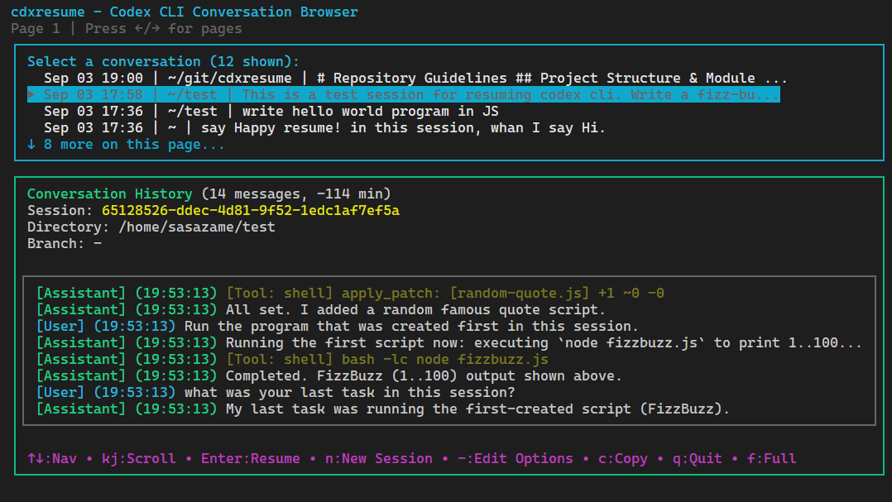

# cdxresume

A character user interface (CUI) tool for browsing and resuming Claude Code conversations.



**⚠️ DISCLAIMER: This is an unofficial third-party tool not affiliated with or endorsed by Anthropic. Use at your own risk.**

## Overview

cdxresume provides an interactive terminal interface to browse and manage your Codex CLI session history. It reads session data from your local Codex CLI logs and displays them in an easy-to-navigate format.

## Disclaimer / Important Notes

- This is an unofficial tool for extending Codex CLI. It is not affiliated with or endorsed by the Codex CLI authors.
- cdxresume uses Codex CLI's experimental resume mechanism: `codex -c experimental_resume=<path-to-jsonl>`.
  - Because it is experimental, resume behavior is not guaranteed and may break at any time.
  - After resuming, the Codex CLI chat UI typically does not restore or render full chat history; only the resumed state is loaded. This is a limitation on the Codex CLI side, not cdxresume.
- This project was created by adapting and reworking the UI/logic from `ccresume` (a Claude Code tool): https://github.com/sasazame/ccresume. It is not a GitHub fork; it is a new repository derived from the original concept and components.

### Key Features

- 📋 Browse all Claude Code conversations across projects
- 🔍 View detailed conversation information
- 📎 Copy session IDs to clipboard
- 🚀 Start new Claude sessions in selected project directories
- 📁 Filter conversations to current directory with `.` argument
- 🎭 Hide specific message types for cleaner display
- ⚙️ Edit Claude command options interactively before starting sessions
- 🔄 Toggle full conversation view to see complete message history


## Installation

### Via npx (Recommended)

```bash
npx cdxresume@latest
```

### Global Installation

```bash
npm install -g cdxresume
```

## Usage

Run the command in your terminal:

```bash
cdxresume
```

Or if using npx:

```bash
npx cdxresume@latest
```

### Command Line Options

#### cdxresume Options

```bash
# Hide specific message types
cdxresume --hide              # Default: hides tool and thinking messages
cdxresume --hide tool         # Hide only tool messages
cdxresume --hide thinking     # Hide only thinking messages
cdxresume --hide user         # Hide only user messages
cdxresume --hide assistant    # Hide only assistant messages
cdxresume --hide tool thinking user  # Hide multiple types

# Filter to current directory
cdxresume .

# Show help
cdxresume --help
cdxresume -h

# Show version
cdxresume --version
cdxresume -v
```

#### Passing Options to Claude

All unrecognized command-line arguments are passed directly to the `claude` command when resuming a conversation.

```bash
# Pass options to claude
cdxresume --some-codex-flag

# Multiple options
cdxresume --model opus

# Combine cdxresume and codex options
cdxresume --hide tool --model opus 
cdxresume . --hide --some-codex-flag
```

**⚠️ Warning**: Since unrecognized arguments are passed to codex, avoid using options that conflict with cdxresume's functionality:
- Don't use options like `--resume` or something like that changes claude's interactive behavior

## Requirements

- **Node.js** >= 18
- **Claude Code** - Must be installed and configured
- **Operating System** - Works on macOS, Linux, and Windows (both native & WSL)

## Command Editor

Press `-` to open the command editor, where you can configure Claude CLI options before starting or resuming a session. The editor provides:

- **Autocomplete suggestions** - Type `-` to see matching Claude options
- **Official help text** - View all available Claude CLI options
- **Interactive editing** - Use arrow keys, Tab for autocomplete, Enter to confirm

The configured options will be passed to Claude when you start a new session (`n`) or resume a conversation (`Enter`).

**Note**: The options list is based on Codex's help text at a specific point in time. Please refer to `codex --help` for the latest available options.

## Keyboard Controls

### Default Key Bindings

| Action | Keys |
|--------|------|
| Quit | `q` |
| Select Previous | `↑` |
| Select Next | `↓` |
| Confirm/Resume | `Enter` |
| Start New Session | `n` |
| Edit Command Options | `-` |
| Copy Session ID | `c` |
| Scroll Up | `k` |
| Scroll Down | `j` |
| Page Up | `u`, `PageUp` |
| Page Down | `d`, `PageDown` |
| Scroll to Top | `g` |
| Scroll to Bottom | `G` |
| Next Page | `→`|
| Previous Page | `←` |
| Toggle Full View | `f` |

### Custom Key Bindings

You can customize key bindings by creating a configuration file at `~/.config/cdxresume/config.toml`:

```toml
[keybindings]
quit = ["q", "ctrl+c", "esc"]
selectPrevious = ["up", "k"]
selectNext = ["down", "j"]
confirm = ["enter", "l"]
copySessionId = ["y"]
scrollUp = ["u", "ctrl+u"]
scrollDown = ["d", "ctrl+d"]
scrollPageUp = ["b", "ctrl+b"]
scrollPageDown = ["f", "ctrl+f"]
scrollTop = ["g"]
scrollBottom = ["shift+g"]
pageNext = ["right", "n"]
pagePrevious = ["left", "p"]
startNewSession = ["n"]
openCommandEditor = ["-"]
toggleFullView = ["f"]
```

See `config.toml.example` in the repository for a complete example.

## Development

### Setup

```bash
# Clone the repository
git clone https://github.com/yourusername/cdxresume.git
cd cdxresume

# Install dependencies
npm install
```

### Available Scripts

```bash
# Run in development mode
npm run dev

# Build the project
npm run build

# Run tests
npm test

# Run tests in watch mode
npm run test:watch

# Generate test coverage
npm run test:coverage

# Run linter
npm run lint

# Type check
npm run typecheck
```

### Project Structure

```
cdxresume/
├── src/              # Source code
│   ├── cli.tsx       # CLI entry point
│   ├── App.tsx       # Main application component
│   └── ...           # Other components and utilities
├── dist/             # Compiled output
├── tests/            # Test files
└── package.json      # Project configuration
```

## Contributing

Contributions are welcome! Please feel free to submit a Pull Request.

1. Fork the repository
2. Create your feature branch (`git checkout -b feature/AmazingFeature`)
3. Commit your changes (`git commit -m 'Add some AmazingFeature'`)
4. Push to the branch (`git push origin feature/AmazingFeature`)
5. Open a Pull Request

## License

MIT

## Support

For issues and feature requests, please use the [GitHub issue tracker](https://github.com/sasazame/cdxresume/issues).

## 🐞 Known Issues

Below are known issues and limitations. Contributions and suggestions are welcome!

| No. | Title | Description | Issue |
|:---:|:------|:-------------|:-----|
## Known Issues

- Preview may occasionally miss the very last assistant text when followed by multiple trailing tool calls. Switching to Full View (key: f) shows everything. We’re investigating; scroll logic will be revisited.
- Tool results are intentionally hidden to avoid layout breaks. Full View shows apply_patch diffs with colors; Preview shows an apply_patch summary only.
- Windows native terminal limitations may affect input handling.
- Resume via `experimental_resume` does not display the full chat history inside Codex CLI after launch. This is an upstream limitation/behavior of the experimental feature.

Remember: This is an unofficial tool. For official Claude Code support, please refer to Anthropic's documentation.
